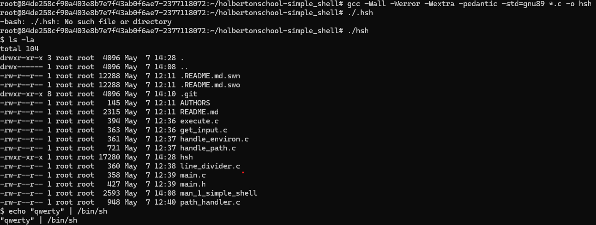

# C - Simple Shell

## Description

The project involved writing a simple shell in C using a limited number of standard library functions.
The goal of this project was to help us understand how the shell works.
A shell, in the context of computing, is a command-line interpreter that provides users with a textual interface to interact with the operating system. It allows users to execute commands, run scripts, and manage system resources through a command-line interface.

### *Typically, a shell provides the following functionalities:* 
1.Command Execution: Runs commands entered by users, ranging from basic file operations to running programs. 
2.Command Parsing: Analyzes commands to identify the command name and its arguments, handling special characters like redirections and pipes. 
3.I/O Redirection: Allows users to redirect input and output streams, like saving command output to a file. 
4.Pipeline Support: Lets users chain multiple commands together, with the output of one command becoming the input of the next. 
5.Background Execution: Runs commands in the background, freeing up the terminal for other tasks. 
6.Scripting: Enables users to automate tasks by writing scripts containing sequences of commands. 
7.Environment Management: Manages the environment, including system configuration settings and program paths. 

## Usage

### *Interactive Mode*
$ ./shell  
$ /bin/ls  
$ exit  

### *Non-interactive Mode*
$ echo "/bin/ls" | ./shell  
$ cat test_file  
$ cat test_file | ./shell  

### *All function descriptions*

Functions | Description
 ------------ | ------------- 
execute_command | Executes the path or commands 
*get_input | My own getline function
handle_env | Handle the first argv element was a env
handle_path | Designed to handle finding and executing commands within the shell environment
*line_devider | Parse a user-provided input string (buffer) into an array of arguments.
path_handler | My own handle_path function

## Installation/Compilation

1. Clone the repository:  
git clone [https://github.com/Pakizamutallim/holbertonschool-simple_shell.git](https://github.com/Pakizamutallim/holbertonschool-simple_shell.git)  
2. Compile the source code:  
gcc -Wall -Werror -Wextra -pedantic -std=gnu89 *.c -o hsh
3. Run the shell:  
./hsh
 
 

## Requirements

To compile and run the shell, you need:
> *C Compiler:* The source code is written in C, so you'll need a C compiler like GCC to compile it.

> *Operating System:* The shell is designed for Unix-like operating systems. It may work on other systems with minor modifications, but it's primarily intended for Unix-based environments.  

**That's all you need to get started with compiling and running the shell!**
